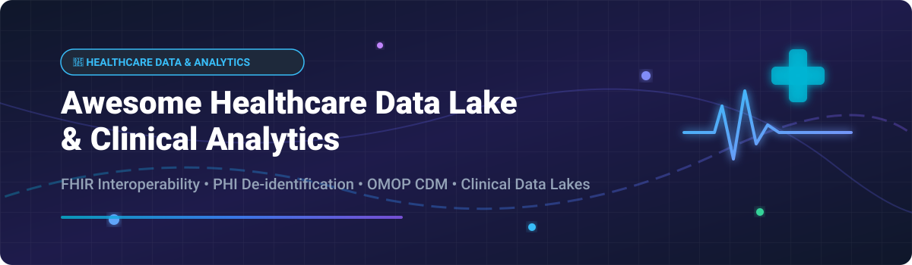

# Awesome-Healthcare-Data-Lake-Analytics 🏥 📊 🚀

  

  
  
  
  
  
  

---

## 🌟 Top Healthcare Data Lake & Clinical Analytics Ecosystem 💡

**The Definitive Curated List of Enterprise Healthcare Data Platforms, Open-Source Clinical Data Frameworks & FHIR Interoperability Infrastructure** ⚡

*Engineered for FHIR Interoperability (R4/R5), PHI De-identification, OMOP Common Data Model, Clinical Data Lakes, Population Health Analytics, HL7 Integration & Self-Hosted Medical Data Pipeline Architecture.* 🔬

**Last updated: October 2026** 📅

---

### 📌 Overview & Deep-Dive SEO Summary 🔍

Welcome to the ultimate curated directory of **healthcare data lake platforms**, **open-source clinical data frameworks**, and **FHIR interoperability tools**. Designed for healthcare software engineers, clinical data scientists, bioinformaticians, and health-tech architects, this repository covers category leaders across cloud hyperscalers (*AWS HealthLake*, *Google Cloud Healthcare API*, *Azure Health Data Services*), specialized clinical analytics vendors (*Innovaccer*, *Health Catalyst*, *Komodo Health*), and production-ready open-source infrastructure (*HAPI FHIR*, *Medplum*, *OHDSI OMOP*, *OpenEMR*, *Keycloak-FHIR*).

**Key Industry Highlights & Market Context:** 📈

- **HAPI FHIR** is the **reference open-source FHIR server** worldwide, powering interoperability initiatives across the **US Centers for Medicare & Medicaid Services (CMS)**, **Apple Health**, and thousands of health systems. 🏥
- **AWS HealthLake**, **Azure Health Data Services**, and **Google Cloud Healthcare API** dominate hyperscaler cloud infrastructure with **HIPAA-eligible FHIR stores**, automated **PHI de-identification**, and integrated **clinical NLP entity extraction**. ☁️
- **Medplum** provides developer-first, **FHIR-native backend services** with built-in React components and automated compliance workflows. 🧑‍⚕️
- **OHDSI (Observational Health Data Sciences and Informatics)** standardized clinical research data across hundreds of millions of patient lives using the **OMOP Common Data Model (CDM)**. 🌐

---

## 📑 Table of Contents 📜

- [🏢 SaaS & Commercial Platforms](#-saas--commercial-platforms)
- [🔓 Open-Source GitHub Projects](#-open-source-github-projects)
- [🛠️ How to Contribute](#%EF%B8%8F-how-to-contribute)
- [🤝 Support & Sponsorship](#-support--sponsorship)
- [📊 Star History](#-star-history)
- [⚠️ Disclaimer](#%EF%B8%8F-disclaimer)

---

## 🏢 SaaS / Commercial Platforms 🏬

> 💡 **Market Size & Structure Analysis (2026–2030):** The global healthcare data lake and analytics market is projected to grow from **$16.6 Billion in 2026 to over $60 Billion by 2030** (CAGR ~24.6%). The market is **moderately concentrated**: cloud hyperscalers (Microsoft, AWS, Google) dominate foundational storage and FHIR APIs, while specialized vendors (Innovaccer, Komodo Health, Health Catalyst) hold domain-specific market share in population health and real-world evidence (RWE). It is not a pure "winner-take-all" market due to strict local regulatory standards and deep EHR integration requirements. 📊

| SaaS / Commercial Platform | Company / Owner | Valuation / Market Cap | Standard Edition Starting Price | Free Tier / Free Trial Limits | Description |
| :--- | :--- | :--- | :--- | :--- | :--- |
| **[Azure Health Data Services](https://azure.microsoft.com/en-us/products/health-data-services/)** 🔷 | Microsoft | ~$3.90 Trillion | **$0.10/GB-month** (FHIR storage) | **Always Free: 1 GB storage, 50k API calls, 100k events/mo** | **Azure-native healthcare platform** — **FHIR, DICOM, and MedTech services** . **De-identification and anonymization** . **Integration with Microsoft Cloud for Healthcare** . **HIPAA and HITRUST compliant** . ⚡ |
| **[AWS HealthLake](https://aws.amazon.com/healthlake/)** ☁️ | Amazon | ~$2.0 Trillion | **$0.11/GB-month** (storage) + **$0.35/1,000 API calls** | **100,000 EventBridge/REST-Hook notification events/mo** | **AWS-native healthcare data lake** — **First HIPAA-eligible FHIR service** . **Petabyte-scale clinical data lake** . **NLP-powered entity extraction** from unstructured medical text . **PHI de-identification** . **FHIR R4 compliant** . 🏥 |
| **[Google Cloud Healthcare API](https://cloud.google.com/healthcare-api)** 🌐 | Google (Alphabet) | ~$2.0 Trillion | **$0.24/GB-month** (FHIR store structured storage) | **1 GB FHIR storage/mo & $300 credits (90-day trial)** | **GCP-native healthcare API** — **FHIR, DICOM, and HL7v2 stores** . **De-identification and DLP integration** . **BigQuery integration for analytics** . **Healthcare NLP for entity extraction** . 🌍 |
| **[Snowflake Healthcare Cloud](https://www.snowflake.com/)** ❄️ | Snowflake | ~$50 Billion | **$2.00/credit** (Standard Edition) | **30-day free trial with $400 credits** | **Data cloud for healthcare** — **Data sharing and collaboration across healthcare organizations** . **Snowpark for Python analytics** . **HIPAA-compliant** . ❄️ |
| **[Databricks HealthLake](https://www.databricks.com/)** 🧱 | Databricks | ~$43 Billion | **$0.15/DBU-hour** (Jobs Compute) | **14-day free trial with $400 credits** | **Lakehouse for healthcare** — **Unified data analytics and AI** . **Delta Lake for clinical data pipelines** . **MLflow for model management** . 🧱 |
| **[Komodo Health](https://www.komodohealth.com/)** 🦎 | Komodo Health | ~$3.3 Billion | **$25,000/year** (Starting platform tier) | **Product demo available on request** | **Real-world data platform** — **Patient-level longitudinal data for life sciences** . **Healthcare Map covering 330M+ patients** . 🦎 |
| **[Innovaccer](https://innovaccer.com/)** 🎯 | Innovaccer | ~$3.2 Billion | **$10,000/month** (Starting enterprise module tier) | **Product demo available on request** | **Healthcare data platform** — **Population health management and value-based care analytics** . **Unified patient records across EHRs, claims, and labs** . 🎯 |
| **[Health Catalyst](https://www.healthcatalyst.com/)** 📊 | Health Catalyst | ~$500 Million | **$50,000/year** (Starting solution package) | **Product demo available on request** | **Data analytics for healthcare** — **Clinical, financial, and operational analytics** . **Population health and value-based care** . 📈 |
| **[Arcadia Analytics](https://arcadia.io/)** 📈 | Arcadia | ~$500 Million | **$30,000/year** (Starting package tier) | **Product demo available on request** | **Population health analytics** — **Value-based care performance management** . **Clinical and claims data integration** . 📊 |
| **[Clarify Health](https://clarifyhealth.com/)** 🔍 | Clarify Health | Private | **$20,000/year** (Starting modular analytics package) | **Product demo available on request** | **Healthcare analytics platform** — **Patient journey and outcomes analytics** . **Value-based care and life sciences** . 🔍 |

---

## 🔓 Open-Source GitHub Projects 💻

*Sorted by GitHub Stars Count (Descending)* 🌟

- **[OpenEMR](https://github.com/openemr/openemr)**  📋  
  **Open-source electronic health records and medical practice management**, GPL-2.0 licensed. **3.8K+ GitHub stars** — **used by 100,000+ healthcare providers worldwide** . **ONC Complete EHR certified** . **The most widely deployed open-source EHR system** . 📋

- **[Open Health Imaging Foundation (OHIF)](https://github.com/OHIF/Viewers)**  🩻  
  **Open-source web-based medical imaging viewer**, MIT licensed. **3.2K+ GitHub stars** — **zero-footprint DICOM viewer with 2D/3D MPR, PET/CT fusion, and AI plugin architecture** . **The global standard for open-source medical imaging** . 🩻

- **[HAPI FHIR](https://github.com/hapifhir/hapi-fhir)**  🏥  
  **The leading open-source Java FHIR framework and server**, Apache-2.0 licensed. **2.8K+ GitHub stars** — **the reference implementation for HL7 FHIR** . **Used by Apple Health, CMS, and thousands of health systems** . **Supports FHIR DSTU2, STU3, R4, R4B, and R5** . **Complete clinical data repository with RESTful API** . 🏥

- **[Medplum](https://github.com/medplum/medplum)**  🧑‍⚕️  
  **Open-source healthcare developer platform**, Apache-2.0 licensed. **2.4K+ GitHub stars** — **FHIR-native APIs, React UI component library, and authentication for building compliant healthcare applications** . **Automated HIPAA and SOC2 compliance infrastructure** . 🧑‍⚕️

- **[OpenMRS](https://github.com/openmrs/openmrs-core)**  🌍  
  **Open-source enterprise electronic medical record system platform**, MPL-2.0 licensed. **2.1K+ GitHub stars** — **deployed across 80+ developing countries** . **Modular clinical management platform engineered for low-resource settings** . 🌍

- **[Synthea Synthetic Patient Generator](https://github.com/synthetichealth/synthea)**  🧪  
  **Open-source synthetic patient data generator**, Apache-2.0 licensed. **1.6K+ GitHub stars** — **simulates realistic longitudinal medical histories of synthetic patients without PHI** . **Exports to FHIR R4, C-CDA, and CSV formats** . **The industry standard for testing healthcare analytics engines** . 🧪

- **[Orthanc DICOM Server](https://github.com/jodogne/orthanc)**  🔬  
  **Lightweight, RESTful DICOM server for medical imaging**, GPL-3.0 licensed. **1.4K+ GitHub stars** — **standalone DICOM store with REST API for automated medical image processing and PACS archiving** . 🔬

- **[OHDSI (Observational Health Data Sciences and Informatics)](https://github.com/OHDSI)**  🌐  
  **Open-source clinical research analytics ecosystem**, Apache-2.0 licensed. **1.2K+ GitHub stars** — **maintains the OMOP Common Data Model (CDM)** for standardizing disparate healthcare databases . **ATLAS cohort generator** and **ACHILLES data quality profiler** . 🌐

- **[Open Health Natural Language Processing (OHNLP)](https://github.com/OHNLP)**  🧠  
  **Open-source clinical NLP framework**, Apache-2.0 licensed. **Developed by Mayo Clinic** — **extracts clinical entities, diagnoses, and medication details from unstructured clinical notes** . **Mapped to ICD-10, SNOMED CT, and RxNorm** . 🧠

- **[FHIR Works on AWS](https://github.com/awslabs/fhir-works-on-aws-deployment)**  ☁️  
  **Open-source serverless FHIR framework on AWS**, Apache-2.0 licensed. **850+ GitHub stars** — **deploys a fully managed FHIR store using AWS Lambda, DynamoDB, and Amazon S3** . ☁️

- **[HAPI FHIR JPA Server Starter](https://github.com/hapifhir/hapi-fhir-jpaserver-starter)**  🚀  
  **Production-ready Spring Boot starter for HAPI FHIR**, Apache-2.0 licensed. **750+ GitHub stars** — **the fastest way to deploy a self-hosted FHIR JPA repository using Docker and PostgreSQL** . 🚀

- **[Inferno FHIR Testing Suite](https://github.com/onc-healthit/inferno)**  ✅  
  **Official ONC FHIR API testing suite**, Apache-2.0 licensed. **450+ GitHub stars** — **verifies compliance with the SMART App Launch Guide and ONC 21st Century Cures Act rule** . ✅

- **[FHIR Resources & Definitions](https://github.com/FHIR/fhir-resources)**  📚  
  **Canonical FHIR specifications and schema definitions**, open-source. **350+ GitHub stars** — **the source-of-truth schemas for all HL7 FHIR data structures** . 📚

---

## 🛠️ How to Contribute 🤝

Contributions are welcomed warmly! Follow these simple steps to submit new healthcare data lake platforms or open-source clinical data software:

1. 🍴 **Fork** the repository.
2. 📝 **Add/edit** entries in `README.md` maintaining table/list structure and formatting.
3. 🔗 Include project title, official website/GitHub link, exact star count badge, license, and brief description.
4. 🚀 Submit a **Pull Request** with a descriptive summary of your changes.

---

## 🤝 Support & Sponsorship ☕

If you find this healthcare data lake & analytics repository valuable for your team or organization, please consider supporting the project:

- ⭐ **Star** this repository on GitHub to increase visibility!
- 🔀 **Fork** and share with fellow healthcare engineers, clinical data scientists, and health-tech founders.
- ☕ **Sponsor & Buy Me a Coffee**: Support ongoing open-source research and community maintenance via the [GitHub Sponsor Dashboard](https://github.com/sponsors/ishandutta2007).

---

## 📊 Star History 📈

---

## ⚠️ Disclaimer ℹ️

- This is a **community-curated directory** — provided for educational and evaluation purposes, not an official endorsement. ℹ️
- **AWS HealthLake, Azure Health Data Services, and Google Cloud Healthcare API** require proper HIPAA Business Associate Agreements (BAA) and security configurations prior to ingesting Protected Health Information (PHI). ☁️
- **Open-source clinical platforms (e.g. HAPI FHIR, OpenEMR, Medplum)** require self-hosted security compliance, database hardening (PostgreSQL/MySQL), and SSL/TLS encryption in transit and at rest. 🔐

---

  <b>Made with ❤️ for healthcare engineers, clinical data scientists, and open-source health-tech innovators worldwide.</b> 🏥 ✨

